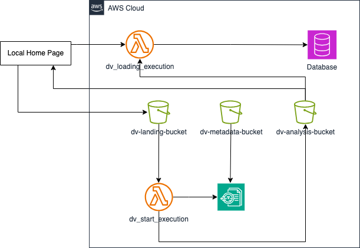

# Project Budget Tracker

## Overview

The **Project Budget Tracker** is a web application designed to help project managers manage project budgets and expenses. The app includes features for tracking budgets, managing expenses, creating reports, and visualizing data across various categories and date ranges.

## Handling Initial Loading Issue
In some cases, when the server starts for the first time, you may encounter a SyntaxError: Invalid or unexpected token in layout.js. This issue is related to how Next.js initializes and transpiles TypeScript/JavaScript components during the first load. This is not a bug in the codebase itself but rather a quirk of the Next.js server when running in development mode.

#### *Why Does This Happen?*
When the Next.js server is restarted, the initial request to the application can sometimes time out during the first page load, especially when complex components such as dynamic imports and fonts (next/font/google) are used.
After this initial load, the issue usually resolves itself and does not occur again during subsequent navigation or page reloads.

#### *Recommended Steps to Mitigate:*
Refresh the Page: If the loading takes more than 5 seconds or you encounter a "SyntaxError: Invalid or unexpected token", simply refresh the browser page (F5 or Ctrl+R).

#### *Conclusion:*
This issue is caused by the server initialization process in Next.js and not due to the implementation of the project code. If you encounter the issue during development, refreshing the page typically resolves it.

---

## **Table of Contents**

0. [Run project locally](#run-locally)
1. [Database Choice](#database-choice)
2. [Tech Stack](#tech-stack)
3. [Libraries Used](#libraries-used)
4. [Project Structure](#project-structure)
5. [Database Objects](#database-objects)
6. [Starting the Database](#starting-the-database)
7. [Starting the Server](#starting-the-server)
8. [Shadcn UI Overview](#shadcn-ui-overview)
9. [TextExtract Overview] (#text-extract-overview)

---

## **Run Locally**

#### *Option 1*: Execute initializer.sh script
1. Open a terminal in the project directory.
2. Run the following command to execute the initializer script:
```bash
sh initializer.sh
```
3. The script will install dependencies, apply migrations, and start the development server.
4. Open your browser and navigate to http://localhost:3000.
5. If you encounter a loading issue, refer to the [Handling Initial Loading Issue](#handling-initial-loading-issue) section.


#### *Option 2*: Execute commands manually
1. Open a terminal in the project directory.
2. Install dependencies:
```bash
npm install
```
3. Apply migrations and create the database schema:
```bash
node src/db/migrations/createTables.js
```
4. (Optional) Seed the database with initial sample data:
```bash
node src/db/seeds/seedData.js
```
5. Start the development server:
```bash
npm run dev
```
6. Open your browser and navigate to http://localhost:3000.
7. If you encounter a loading issue, refer to the [Handling Initial Loading Issue](#handling-initial-loading-issue) section.

# Clean Database
Upon running the initializer.sh script, the database is seeded with sample data. If you wish to start with a clean database, you can delete the file that has been automatically created on /src/db/budget_tracker.db

---

## **Database Choice**

### **SQLite (File-based)**

#### **When to Use:**
A lightweight, embedded database with minimal setup.

#### **Pros:**
- Easy to set up and use.
- No separate server required.
- Suitable for small-scale projects.

#### **Cons:**
- Not ideal for concurrent writes in large-scale projects.
- Limited scalability.

#### **Recommendation:**
I've chosen SQLite because it offers simplicity and suits our needs for a lightweight, embedded database. It is ideal for small-scale applications that do not require extensive concurrency or scalability.

[Learn more about SQLite](https://www.sqlite.org/index.html)

### **Other Database Options Considered**

#### **PostgreSQL (Relational DB)**
- **Pros:**
    - Supports complex queries and relationships.
    - Highly reliable and scalable.
    - Open-source.
- **Cons:**
    - Requires more setup than SQLite.
    - Overkill for small-scale projects.
- **Reason Not Chosen:** The project does not require the advanced features of PostgreSQL.

#### **MongoDB (NoSQL)**
- **Pros:**
    - Flexible schema with JSON-like storage.
    - Good for hierarchical or unstructured data.
- **Cons:**
    - Less suited for relational data.
    - Complex queries can be challenging.
- **Reason Not Chosen:** The application’s data is better structured relationally.

#### **Firebase Realtime Database or Firestore (NoSQL, Cloud-based)**
- **Pros:**
    - Real-time updates.
    - Backend-as-a-service with minimal setup.
- **Cons:**
    - Cost increases with usage.
    - Limited for complex queries.
- **Reason Not Chosen:** Cost and real-time capabilities are not priorities for this project.

---

## **Tech Stack**

### **Frontend:**
- **Framework:** Next.js (v15.1.3), React (v19.0.0)
- **Styling:** Tailwind CSS, clsx, tailwind-merge
- **Form Validation:** react-hook-form, zod for schema validation
- **Icons:** lucide-react, react-icons
- **Charts:** recharts for data visualizations
- **Components:** Radix UI for accessible UI components

### **Backend:**
- **Database:** SQLite3
- **Query Builder:** Knex.js (v3.1.0)

### **Development Tools:**
- TypeScript for type safety
- ESLint for linting and code formatting

---

## **Libraries Used**

| Library             | Purpose                                          | Installation Command                  |
|---------------------|--------------------------------------------------|----------------------------------------|
| `sqlite3`           | SQLite client for Node.js                        | `npm install sqlite3`                  |
| `knex`              | SQL query builder for Node.js                    | `npm install knex`                     |
| `react-hook-form`   | Form handling for React                          | `npm install react-hook-form`          |
| `zod`               | Schema validation                                | `npm install zod`                      |
| `recharts`          | Data visualization library                       | `npm install recharts`                 |
| `tailwindcss`       | Utility-first CSS framework                      | `npm install tailwindcss`              |
| `radix-ui`          | UI primitives (dialog, popover, select, etc.)    | Included via individual Radix imports  |

---

## **Project Structure**

```bash
src/
├── app/
│   ├── api/                # API routes for CRUD operations
│   ├── budgets/            # Budget-related pages and components
│   ├── categories/         # Category-related pages and components
│   ├── expenses/           # Expense-related pages and components
│   ├── managers/           # Manager-related pages and components
│   └── projects/           # Project-related pages and components
├── components/             # Reusable UI components (e.g., buttons, tables, charts)
├── db/                     # Database connection and setup
│   ├── database.js         # SQLite setup
│   ├── migrations/         # Database schema migrations
│   └── seeds/              # Sample seed data (optional)
├── styles/                 # Global styles and Tailwind CSS configuration
└── types/interfaces/       # TypeScript interfaces and type definitions
```

## **Database Objects**

### **Project**
- `id`: Unique identifier.
- `name`: Name of the project.

### **Manager**
- `id`: Unique identifier.
- `name`: Name of the manager.

### **Budget**
- `id`: Unique identifier.
- `name`: Name of the budget.
- `totalAmount`: Total allocated amount for the budget.
- `projectId`: Foreign key linking to the associated project.
- `categoryId`: Foreign key linking to the associated category.

### **Expense**
- `id`: Unique identifier.
- `amount`: Expense amount.
- `description`: Description of the expense.
- `date`: Date when the expense was made.
- `budgetId`: Foreign key linking to the related budget.
- `categoryId`: Foreign key linking to the associated category.

### **Category**
- `id`: Unique identifier.
- `name`: Name of the category.
- `color`: Color associated with the category for visual representation.

---

## **Starting the Database**

1. Open a terminal in project directory
2. Run the following command to apply the migrations and create the database schema:
```bash
node src/db/migrations/createTables.js
```
3. (Optional) Seed the database with initial sample data.
```bash
node src/db/seeds/seedData.js
```
## **Starting the Server**

To run the development server:
```bash
npm run dev
```
Open your browser and navigate to http://localhost:3000.

## **Shadcn UI Overview**

The **Shadcn UI** is a set of highly customizable UI components built using Radix Primitives, providing accessible and composable UI elements for modern web applications.

### **Commonly Used Components:**

1. **Tabs**
    - Used to navigate between "Overview", "Analytics", and "Reports" sections.
    - [Documentation](https://www.radix-ui.com/docs/primitives/components/tabs)

2. **Card**
    - Displays summarized information such as "Total Projects", "Total Budgets", and "Total Expenses".
    - [Documentation](https://www.radix-ui.com/docs/primitives/components/card)

3. **Dialog**
    - Modal pop-up used for forms to create or update data (e.g., projects, budgets, categories, and expenses).
    - [Documentation](https://www.radix-ui.com/docs/primitives/components/dialog)

4. **Input**
    - Used for user inputs in forms (e.g., entering names, amounts, or descriptions).
    - [Documentation](https://www.radix-ui.com/docs/primitives/components/input)

5. **Select**
    - Dropdown component used for selecting categories, budgets, or project associations.
    - [Documentation](https://www.radix-ui.com/docs/primitives/components/select)

6. **Popover and Calendar**
    - Used in the date picker component for selecting date ranges.
    - [Documentation for Popover](https://www.radix-ui.com/docs/primitives/components/popover)

## **Text Extract Overview**
## 🌟 Features

### 🚀 **File Upload**
- Upload PDF documents and corresponding metadata in JSON format.
- Automatically stores files and metadata in designated S3 buckets (`dv-landing-bucket` and `dv-metadata-bucket`).

### ⚙️ **Processing**
- Processes uploaded PDFs using AWS Textract.
- Supports extraction of key-value pairs, query answers, tables, and other structured data.
- Saves extracted results in the `dv-analysis-bucket`.

### 🔍 **Results Viewer**
- View and filter results on the results page.
- Organize data by queries or view all extracted data in a table.
- Filter by data type (e.g., LINE, WORD, KEY_VALUE_SET, QUERY).

---

## 🛠️ Technologies

- **Terraform**: Infrastructure as Code (IaC) to automate deployment and resource management on AWS.

---

## 📜 Metadata Example

When uploading a PDF file, a corresponding metadata file in JSON format is required. The metadata contains queries that AWS Textract uses to extract specific information from the document. Below is an example of the metadata structure:

```json
{
   "query": {
      "PERIOD": {
         "Text": "Which period is the report?"
      },
      "BUDGET_ALLOCATION": {
         "Text": "What is the Budget Allocation for Client Onboarding System?"
      },
      "EXPENSES": {
         "Text": "What is the Expenses for Cybersecurity Enhancement?"
      }
   }
}
```

In this example:
- `PAYSTUB_YTD_GROSS` and `PAYSTUB_CURRENT_GROSS` are aliases for the queries.
- The `Text` field defines the specific questions Textract will use to extract data.

This flexible structure allows users to tailor queries for various types of documents.

---

## 🧩 Architecture



### 📥 File Upload
1. Upload PDFs and metadata via the home page form.
2. Files are stored in:
    - `dv-landing-bucket` for PDFs.
    - `dv-metadata-bucket` for metadata.

### 📡 Processing
1. S3 triggers an AWS Lambda function upon file upload.
2. Lambda invokes AWS Textract with the document and metadata queries.
3. Extracted data is saved in the `dv-analysis-bucket`.

### 📈 Results Viewer
1. The results page fetches data from the `dv-analysis-bucket`.
2. Users can filter, view, and analyze the extracted information.

---

## 💼 AWS Services and Estimated Costs (eu-west-1)

| **Service**         | **Usage**                                                                 | **Approx. Cost (Monthly)** |
|----------------------|--------------------------------------------------------------------------|---------------------------|
| **Amazon S3**        | Storage for uploaded files, metadata, and results (10 GB total/month).  | ~€1.15                   |
| **AWS Lambda**       | Processing uploaded documents (100,000 invocations, 512 MB memory).     | ~€2.50                   |
| **Amazon Textract**  | Document analysis (1,000 pages/month).                                  | ~€1.50                   |
| **CloudWatch Logs**  | Logging Lambda invocations (50 GB logs/month).                          | ~€5.00                   |
| **IAM**              | Managed roles for secure access.                                        | Free                     |
| **API Gateway**      | For frontend-Lambda communication (if used, 1 million requests/month).  | ~€3.00                   |

**Total Approx. Monthly Cost**: **~€13.15** (Costs may vary depending on actual usage).

## 💻 Local Development

### Prerequisites
- AWS Account with configured S3 buckets and IAM roles.
- Node.js and Terraform installed on your machine.

### Setup

1. **Clone the Repository**:
   ```bash
   git clone <repository-url>
   cd <repository-directory>
   ```

2. **Install Dependencies**:
   ```bash
   npm install
   ```

3. **Set Environment Variables**:  
   Create a `.env.local` file in the root directory:
   ```bash
   NEXT_PUBLIC_AWS_REGION=eu-west-1
   NEXT_PUBLIC_AWS_ACCESS_KEY_ID=<your-access-key-id>
   NEXT_PUBLIC_AWS_SECRET_ACCESS_KEY=<your-secret-access-key>
   NEXT_PUBLIC_LAMBDA_FUNCTION_NAME=<lambda-function-name>
   NEXT_PUBLIC_S3_BUCKET=dv-landing-bucket
   NEXT_PUBLIC_S3_METADATA_BUCKET=dv-metadata-bucket
   NEXT_PUBLIC_S3_ANALYSIS_BUCKET=dv-analysis-bucket
   ```

4. **Start Development Server**:
   ```bash
   npm run dev
   ```

5. **Deploy Infrastructure with Terraform**:  
   Navigate to the Terraform directory and deploy:
   ```bash
   terraform init
   terraform apply
   ```

---
## ✈️ Deployment

### Prerequisites
- AWS Account with configured S3 buckets and IAM roles.
- Node.js and Terraform installed on your machine.

### Setup
1. **Clone the Repository**:
   ```bash
   git clone <repository-url>
   cd <repository-directory>
   ```

2. **Install Dependencies**:
   ```bash
   npm install
   ```

3. **Set Environment Variables**:  
   Create a `.env.local` file in the root directory:
   ```bash
   NEXT_PUBLIC_AWS_REGION=eu-west-1
   NEXT_PUBLIC_AWS_ACCESS_KEY_ID=<your-access-key-id>
   NEXT_PUBLIC_AWS_SECRET_ACCESS_KEY=<your-secret-access-key>
   NEXT_PUBLIC_LAMBDA_FUNCTION_NAME=<lambda-function-name>
   NEXT_PUBLIC_S3_BUCKET=dv-landing-bucket
   NEXT_PUBLIC_S3_METADATA_BUCKET=dv-metadata-bucket
   NEXT_PUBLIC_S3_ANALYSIS_BUCKET=dv-analysis-bucket
   ```
4. **Build Frontend**:
    ```bash
    npm run build
    ```

5. ** Prepare Lambdas **:
   ```bash
   zip -r start_execution.zip start_execution.py
   ```

6. **Deploy Infrastructure with Terraform**:  
   Navigate to the Terraform directory and deploy:
   ```bash
   terraform init
   terraform apply
   ```
7. **Add less bucket restriction**:
   Go to the bucket policy of the dv-analysis-bucket and add the following policy:
    ```json
    {
	"Version": "2012-10-17",
	"Statement": [
		{
			"Sid": "AllowSpecificAccess",
			"Effect": "Allow",
			"Principal": "*",
			"Action": "s3:GetObject",
			"Resource": "arn:aws:s3:::dv-webpage-bucket/*"
        }
    ]
    }
    ```

7. **Load files to webhosting**:
   Load all documents from the ./out generated folder (in step 4) into the webhosting bucket.

8. **Access the website**:
   Access the website using the endpoint generated by bucket.
   (http://dv-webpage-bucket.s3-website-eu-west-1.amazonaws.com/)

---

## 🚦 How to Use

### Home Page
1. **Upload File and Metadata**:
    - Enter the file name.
    - Select a PDF document and its metadata (JSON file).
    - Click **Start Process** to initiate processing.

2. **Check Results**:
    - Once processing is complete, click **Check Results** to view the extracted data.

### Results Page
1. **View Results**:
    - Select a processed file to load its data.
    - Use the filter to narrow down results by type.

2. **Switch Tabs**:
    - View **Query Results** for specific questions and answers.
    - View **All Data** for the complete processed data.

---

## 🛡️ Troubleshooting

- **File Upload Errors**:
    - Ensure the uploaded file is in PDF format.
    - Verify the metadata follows the correct JSON structure.

- **Processing Errors**:
    - Check AWS CloudWatch logs for Lambda function errors.

- **Missing Results**:
    - Verify the `dv-analysis-bucket` contains the processed results.

---